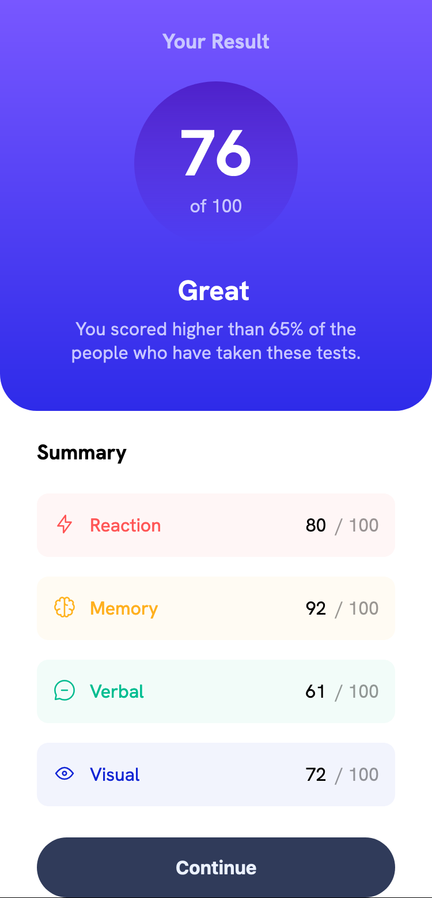
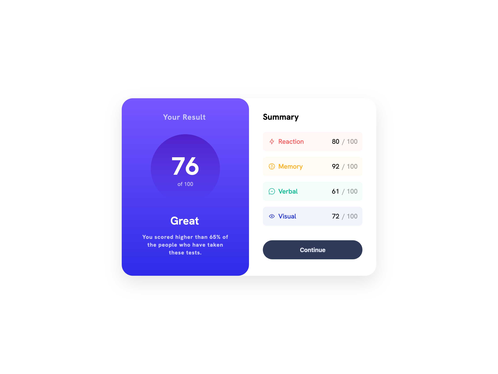

# Frontend Mentor - Results summary component solution

This is a solution to the [Results summary component challenge on Frontend Mentor](https://www.frontendmentor.io/challenges/results-summary-component-CE_K6s0maV). Frontend Mentor challenges help you improve your coding skills by building realistic projects.

## Table of contents

- [Overview](#overview)
  - [The challenge](#the-challenge)
  - [Screenshot](#screenshot)
  - [Links](#links)
- [My process](#my-process)
  - [Built with](#built-with)
  - [What I learned](#what-i-learned)
  - [Continued development](#continued-development)
  - [Useful resources](#useful-resources)
- [Author](#author)

## Overview

### The challenge

Users should be able to:

- View the optimal layout for the interface depending on their device's screen size
- See hover and focus states for all interactive elements on the page
- **Bonus**: Use the local JSON data to dynamically populate the content

### Screenshot

|  Mobile designed at 375px:   |  Desktop designed at 1440px:  |
| :--------------------------: | :---------------------------: |
|  |  |

### Links

- Solution URL: [Add solution URL here](https://your-solution-url.com)
- Live Site URL: [Add live site URL here](https://your-live-site-url.com)

## My process

### Built with

- Semantic HTML5 markup
- CSS custom properties
- Flexbox
- CSS Grid
- Mobile-first workflow
- Javascript JSON data import using fetch

### What I learned

- [Background gradients](https://developer.mozilla.org/en-US/docs/Web/CSS/gradient/linear-gradient)
- [How to change the alpha of an HSL color while still using a CSS custom property](https://stackoverflow.com/questions/76173508/how-to-change-alpha-of-an-hsl-color-if-the-color-comes-from-a-css-custom-propert)
- [Utilizing inline- versions of grid and flex](https://stackoverflow.com/questions/66948139/how-to-prevent-css-grid-from-taking-up-full-width)
- Learning more about flex alignment properties (e.g., flex grow), [including how to set a width of a flex box](https://stackoverflow.com/questions/29885284/how-to-set-a-fixed-width-column-with-css-flexbox)
- Using transform translate to make small adjustments (e.g., [a shifty component](https://www.joshwcomeau.com/css/pixel-perfection/))
- [Modifying letter-spacing of text](https://developer.mozilla.org/en-US/docs/Web/CSS/letter-spacing)
- Importing [local JSON data](https://developer.mozilla.org/en-US/docs/Web/API/Response/json) to dynamically populate the content
- [Why is there an "Uncaught SyntaxError: unexpected token: 'assert'" in Firefox but not in Chrome?](https://stackoverflow.com/questions/74612444/problem-with-import-json-in-firefox-but-in-other-browsers-it-work) The answer is that [assert is not supported in most browsers](https://developer.mozilla.org/en-US/docs/Web/JavaScript/Reference/Statements/import#browser_compatibility), and the better way to [import JSON data](https://www.freecodecamp.org/news/how-to-read-json-file-in-javascript/) is by using Fetch.

### Continued development

I'm not sure that I'm getting the fonts quite right when comparing the design to my solution. It seems like some of the fonts have letter-spacing different than the default, but it's hard to tell.

I'd also like to get clearer on a [design system](https://www.figma.com/design-systems/) for how to systematize my thinking about when to use margins vs. paddings, and the particular values that I rely on for each of them. And just [learn more about design systems](https://help.figma.com/hc/en-us/articles/14552901442839-Overview-Introduction-to-design-systems) more generally.

### Useful resources

- Great [examples using json and fetch are available on the MDN Web Docs](https://developer.mozilla.org/en-US/docs/Web/API/Response/json), including in their [DOM examples on Github](https://github.com/mdn/dom-examples/) and the [live examples too](https://mdn.github.io/dom-examples/). And there's more. They have [Web Components examples on GitHub]() and [live as well](https://mdn.github.io/web-components-examples/). [What other kinds of examples does MDN have?](https://developer.mozilla.org/en-US/) Will be referencing all of these examples much more in the future!

## Author

- Website - [Eli Silk](https://github.com/elisilk)
- Frontend Mentor - [@elisilk](https://www.frontendmentor.io/profile/elisilk)
